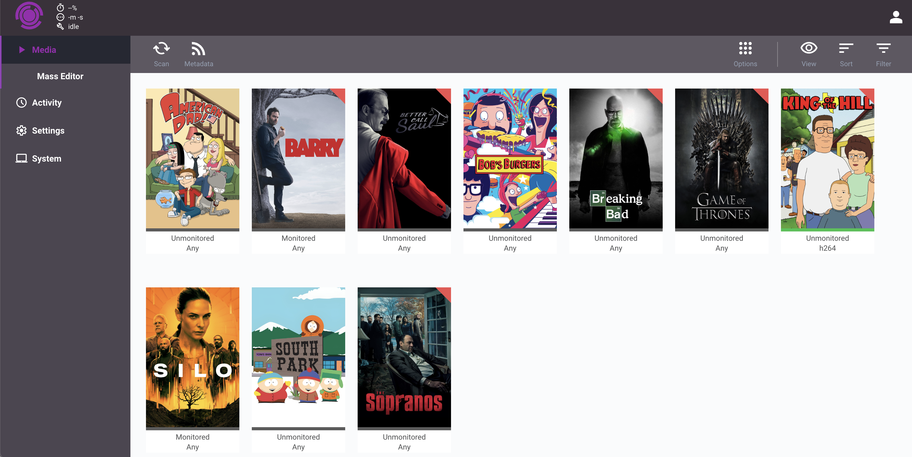

<br/>
<p align="center">
  <a href="https://github.com/Transfigurr/Transfigurr">
    
  </a>

  <h3 align="center">Transfigurr</h3>

  <p align="center">
    A modern codec management and automation tool
    <br/>
    <br/>
    <a href="https://github.com/Transfigurr/Transfigurr">View Demo</a>
    .
    <a href="https://github.com/Transfigurr/Transfigurr/issues">Report Bug</a>
    .
    <a href="https://github.com/Transfigurr/Transfigurr/issues">Request Feature</a>
  </p>
</p>

  

## Table Of Contents

- [About Transfigurr](#about-transfigurr)
- [Built With](#built-with)
- [Getting Started](#getting-started)
  - [Prerequisites](#prerequisites)
  - [Installation](#installation)
- [Usage](#usage)
- [Roadmap](#roadmap)
- [Contributing](#contributing)
- [License](#license)
- [Authors](#authors)

## About Transfigurr



There are many great media management and re-encooding tools available, however, I didn't find one that fully met my requirements for a self-hosted re-encoding application. This led me to create Transfigurr. Transfigurr is a comprehensive media managament and re-encoding application designed to be user friendly and highly configurable. It aims to be the last re-encoding solution you'll ever need.

Here's why:

- Beautiful modern UI
- Series specific profiles
- Containerized to easily integrate with your other media applications and manage resources

Of course, no one service will serve all use cases since your needs may be different. So I'll be adding more in the near future. You may also suggest changes by forking this repo and creating a pull request or opening an issue.

## Built With

### Frontend

- TypeScript
- React
- Sass

### Backend

- Python
- FastAPI

## Getting Started

Steps to run the project locally for development or testing purposes.

Please follow the Usage guide to simply install and use the containerized application

### Prerequisites

- pip

- npm

- FFmpeg

### Installation

1. Get a free API Key at [https://www.themoviedb.org/settings/api](https://www.themoviedb.org/settings/api)

2. Clone the repo

```sh
git clone https://github.com/Transfigurr/Transfigurr.git
```

3. Install PIP packages

```sh
pip install -r requirements.txt
```

4. Install NPM packages

```sh
cd frontend
npm install
```

## Usage

1. Pull

```docker
docker pull transfigurr/transfigurr
```

or

```docker
docker pull ghcr.io/transfigurr/transfigurr
```

2. Run

```docker
docker run transfigurr
```

3.

Visit {your-server-ip}:7889

## Roadmap

- Advanced video and audio profile settings
- Individual episode monitoring
- Improved data presentation
- Task Scheduling
- Support for movies

See the [open issues](https://github.com/Transfigurr/Transfigurr/issues) for a list of proposed features (and known issues).

## Contributing

Contributions are what make the open source community such an amazing place to be learn, inspire, and create. Any contributions you make are **greatly appreciated**.

- If you have suggestions for adding or removing projects, feel free to [open an issue](https://github.com/Transfigurr/Transfigurr/issues/new) to discuss it, or directly create a pull request after you edit the _README.md_ file with necessary changes.
- Please make sure you check your spelling and grammar.
- Create individual PR for each suggestion.

### Creating A Pull Request

1. Fork the Project
2. Create your Feature Branch (`git checkout -b feature/AmazingFeature`)
3. Commit your Changes (`git commit -m 'Add some AmazingFeature'`)
4. Push to the Branch (`git push origin feature/AmazingFeature`)
5. Open a Pull Request

## License

Distributed under the GPL-3 License. See [LICENSE](https://github.com/Transfigurr/Transfigurr/blob/main/LICENSE.md) for more information.

## Authors

- **[Alex Keith](https://github.com/alexmichaelkeith)** - _Computer Science Student_ - _Built Transfigurr_
